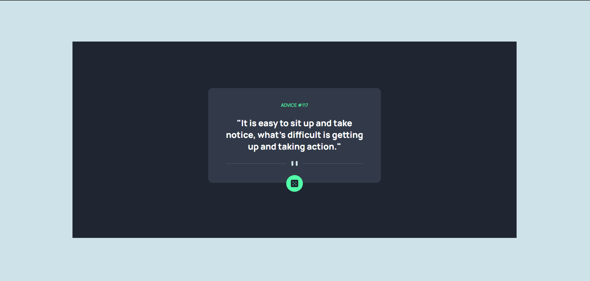
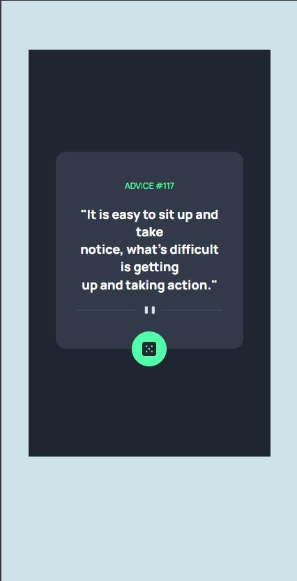

# Advice-Generator-App
This simple web app uses api to generate random advices

## Table of contents

## Overview

#The Challange
This challenge is to build out an advice generator app using the Advice Slip API and get it looking as close to the given design as possible.

##Screenshot

### Links
- Live Site URL: [https://advice-generator-app-tau-nine.vercel.app/]
- Solution URL: []

## My Process
Firstly i set up my files html, css and javascript files, then i went ahead to setup my html file, setting up the html syntax, the header and body. Then i connected the files. I then created image folder i used to store my images that will be used in the app. I then added links tag to the header of the html file, link tag for font and app icon, then i set the title of the app "Advice Generator App". Then i started setting up the raw html elements for the project body. After setting that up, i gave the containers and necessary elements class names that will be used for the styling. I then started styling, i set up the css styling using the class names. After i was done i then moved to the javascript functionality for the app, i had to assign id to the elements i would be using to run the function. When i got the functionality to work, i then moved back to the styling to set up the media query for mobile and desktop, larger screens and smaller screens. 

##Built with
-HTML
-CSS
-JAVASCRIPT

#What i learned

What i learned from the html and css.
-I learned that i should know how to structure my elements, so that it does not cause conflicts when building.

What i learned was from the javascript.
- I learned that performing a Dom manipulation, using document.querySelector, when trying to use class names which entails that a dot should be added before the class name 
(document.querySelector(".description");

-When using document.getElementById, i should make sure to have an id assigned to the html element in the document which will be used to get the element id in the javascript function.

##Continued Development
I want to continue working on projects that uses dom manipulation and api integrations because my weakness is in this api integration.

##Useful resources
-i made use of chatgpt for some road blocks i had while building

